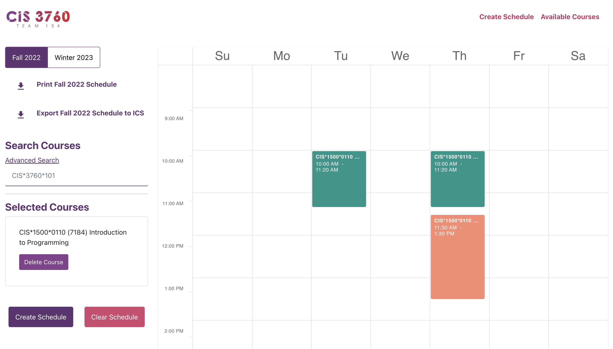
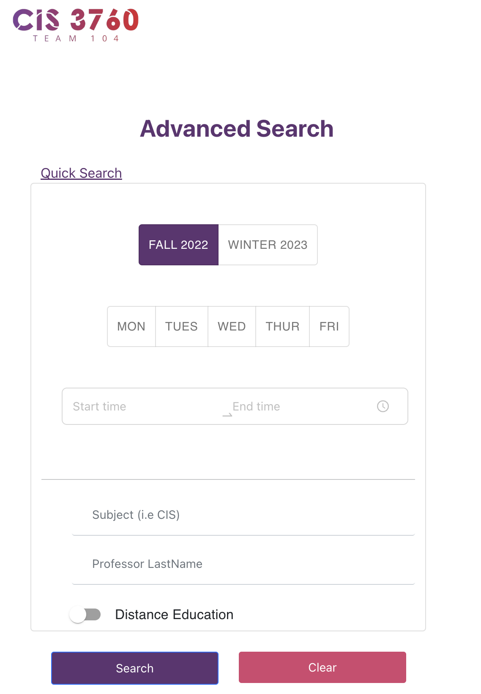
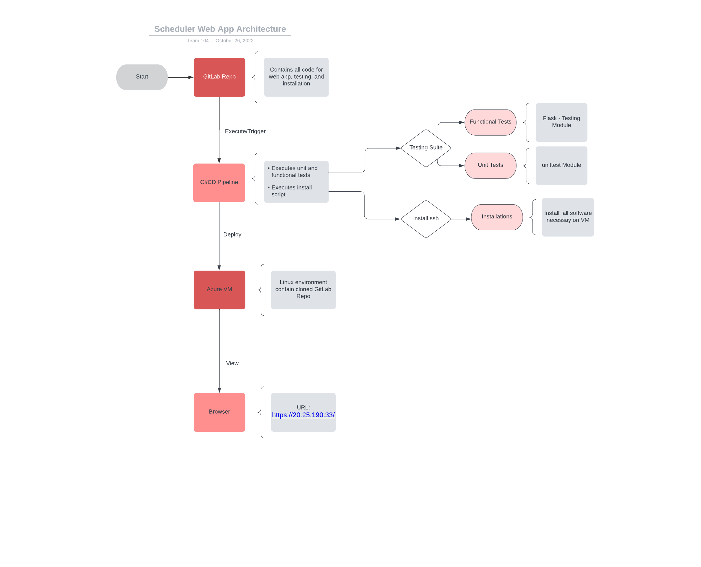

# Project Title : F22 CIS*3760 Sprint 9
 
# Authors
 Harir Al-Rubaye, Michaela Hibbert, Sky Truong, Justin Klein, Pradhapan 
 Rajendran, Faraan Usman, Emma Shortt, and Dipto Biswas

# Contents of this file
 * Files included
 * Introduction
 * Description
 * Extra Features
 * Requirements 
 * User Guide
 
# Files included

### sprint 1: 
* parse_utils.py
* course.py
* dict_types.py	
* search.py	
* main.py	
* parser.py	

### Unit Tests (sprint 1) 
* course_unittests.py
* parse_utils_unittests.py
* parser_unittests.py

### sprint 2:
* loadToCSV.py

### sprint 3:
* CIS3760_Sprint3.xlsm
* CIS3760_User_Guide.pdf

### sprint 4: 
* install.sh
* run.sh
* .gitlab-ci.yml
* server/app.py
* server/Requirements.txt
* server/server

### sprint 5:
* run-script.sh
* server/tests
	* functional/test_app.py
	* unit/test_file.py
	* test_functions.py
* server/data/course_data.json
* sprint4/src/pages:
  * CourseData.js, Table.js, welcome.js
			

### sprint 6:
* sprint-4/src/functions/BinarySearch.js
* sprint-4/src/functions/CourseData.js
* sprint-4/src/pages/ChosenList.js
* sprint-4/src/pages/DevExpressSchedule.js
* sprint-4/src/pages/Search.js
* sprint-4/src/pages/SuggestedList.js
* sprint-4/src/pages/Table.js
* server/tests/functional/test_app.py
* server/tests/unit/test_file.py
* server/tests/test_functions.py
* server/data/course_data.json
* sprint-4/src/pages/CourseData.js

## sprint 7:
* updated all files to adhere to linting methods
* config files for pylint and eslint
* Research/Sprint7/pylint_research.md

## sprint 8:
* added support for winter courses
* added react-router
* added a new page for viewing available courses (currently dummy data)
* added a delete course button for individual course removal
* added a clear course button to fully clear all selections
* now store user selections in cookies, user can refresh the page to see
* front end testing

## sprint 9:
* course-scheduler-app/src/pages/DisplayFilterCourses.js
* course-scheduler-app/src/pages/DisplayFilterCourses.test.js
* course-scheduler-app/src/pages/ScheduleButtons.js
* course-scheduler-app/src/pages/availableCourses.js


# Introduction

Our sprint goal was to updated our web application to allow the user to create a course schedule with similar functionality to that of sprint 2.

 * Access the web application at the following URL: https://20.25.190.33/

 * For quick guide on How to set up React, visit the following page:
	https://gitlab.socs.uoguelph.ca/eshortt/cis3760-104-online/-/blob/sprint4/Research/Sprint4/CIS3760_REACT_Setup.pdf

 * For quick guide on React, visit the following page:
	https://gitlab.socs.uoguelph.ca/eshortt/cis3760-104-online/-/blob/sprint4/Research/Sprint4/CIS3760_ReactResearchDoc_FrontEnd.pdf
	
# Description

The user can enter courses by search (case insensitive) in the search bar for courses, clicking "add course" to add the course the the schedule. The user can enter up to 5 courses and then click "Create Schedule" to fill the schedule. The user can also utilize an advanced search option to view details of the courses before adding them to the schedule.





An install script that installs and configures all of the followung on Linux have been added:
* NGINX. A basic website with HTML, CSS, and JavaScript, served on NGINX (https://20.25.190.33/)
* The user interface was built using React
* This site uses the Bootstrap template
* Node.js

# App Architecture
Please review the following diagram that illustrates the architectural design of this web app.



# Extra Features
***Sprint 2***
* Button ("Delete All Pages") to delete all the schedules created
* Button ("New Search") to clears the contents of the cells containing classes and the data in drop-downs.
Then refreshes the workbook, preparing for a new search.
* Button ("Create Exam Schedule") to add Exam Schedule
* Checks for duplicates and invalid course input (warning message will pop up)
* Courses have different colors assigned to them. 
* Courses show as green when they can be found in the search and red when they cannot be found.
* There are checks to see if the course has any meeting infomation and if not, it is printed at the botton of the schedule under "Courses with no meeting time:"

***Sprint 3***
* Checks for valid preference.
	* User receives pop-up warning if preferences input is empty.
	* User receives pop-up warning for invalid Day/Time preferences (ie. duplicate days, start time < end time).
* Checks for any conflicts exist between the courses.
	* User receives pop-up warnings as those courses overwritten.
	* A conflict info box will appear next to schedule which lists all conflicts
* Button ("Clear Drop-downs") to clear any data entered in drop-downs

***Sprint 4***
* GitLab pipeline builds the project
* Nginx project deployed to Azure Linux VM via pipeline

***Sprint 5***
* Pipeline overhaul - pipeline no longer re-installs all dependencies, just updates the web app and redeploys
* Automated tests & deployment occur with every merge request into the `master` branch

***Sprint 6***
* Auto-search functionality
* Automated tests for back-end
* User guide for updated version of web app

***Sprint 7***
* Research docs
* new pipeline for linting check automatically

***Sprint 8***
* Winter 2023 courses have been added for selection
* Now able to print out the course schedule
* New page for checking available courses
* Selections are cached in browser cookies, now can exit/refresh the page and your course selections will be saved
* Frontend snapshot testing with Jest

***Sprint 9***
* Advanced search page:
	* Displays all course information
	* Filters for search page
* Export to other calendar apps option
* New UI

# Requirements

## Sprint 1 - 3
### 1. Ensure Python 3.10.7 is installed on your device.

### 2. This project requires you enable macros:

Option 1:

Click the File tab.
Click Options.
Click Trust Center, and then click Trust Center Settings.
In the Trust Center, click Macro Settings.
Macro settings area of trust center
Make the selections that you want, then click OK.


Option 2:

Open file
Pop-up will appear asking you to enable macros
Click "Enable"
   
# User Guide

### 1. Clone the project from gitlab - to view code

1. Go to the page of the repository that you want to clone (sprint2 branch) 
2. Click on “Clone or download” and copy the URL.
3. Use the git clone command along with the copied URL from earlier.
4. Run the following on the command line: 

```
$ git clone --branch sprint6 https://github.com/USERNAME/REPOSITORY
```
5. Press Enter.
 
### 2. Run the Program
#### Option 1 (Sprint 2):
1. Open the Excel File (CIS3760_Sprint3.xlsm)
2. Enter the courses you desire to add
3. Press the create schedule buttom 
4. That's it! Review your newly created schedule 

#### Option 2 (Sprint 3):
1. Open the Excel File (CIS3760_Sprint3.xlsm)
2. Enter the courses you desire to add if you have any
3. Enter Day or Time in drop-down
4. Select desired critera
3. Press the suggest schedule buttom 
4. That's it! Review your newly created schedule 

#### Option 3 (Sprint 4-9):

 * For a guide on how to access the VM, visit the following page:
	https://gitlab.socs.uoguelph.ca/eshortt/cis3760-104-online/-/blob/sprint4/VmDocs.md

 * Access the web application at the following URL: https://20.25.190.33/
